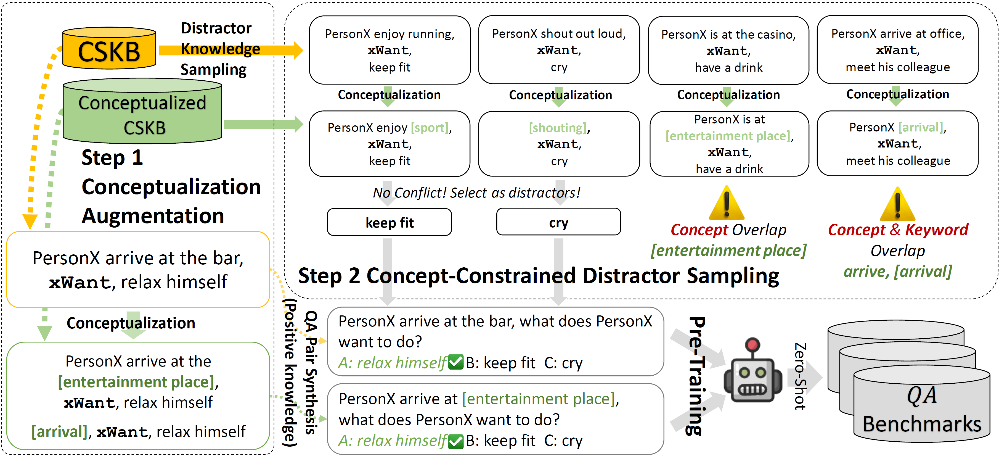

# CAR: Conceptualization-Augmented Reasoner for Zero-Shot Commonsense Question Answering

This is the official code and data repository for the paper published in Findings of EMNLP2023: [CAR: Conceptualization-Augmented Reasoner for Zero-Shot
Commonsense Question Answering](https://arxiv.org/pdf/2305.14869.pdf).



## 1. Download Data & Model Checkpoint

All conceptualization data, including the discriminator and generator models, can be downloaded
at [this link](https://hkustconnect-my.sharepoint.com/:f:/g/personal/wwangbw_connect_ust_hk/EnA7X6PkeE5Dll9sdlwxuG4BH8zw-Bpdtc5kw3L70Shu5g).
Please refer to our [previous ACL2023 paper](https://arxiv.org/abs/2305.04808) and [GitHub Repo](https://github.com/HKUST-KnowComp/CAT) for more details.

The training data and model checkpoint of our best DeBERTa-v3-Large QA model trained by CAR can be downloaded
at [this link](https://hkustconnect-my.sharepoint.com/:f:/g/personal/wwangbw_connect_ust_hk/EqC6BjWPGi1IgEPLbfMWk7gBFAn-cpfQAmTUsQBoUzVkqw).

## 2. Required Packages

Required packages are listed in `requirements.txt`. Install them by running:

```bash
pip install -r requirements.txt
```

## 3. Model Training

Use the following command to train the CAR model at the directory of `source/Training/`.
You can change the directory of `train_file` and `dev_file` to train on different data.
You can also adjust `per_gpu_train_batch_size` and `gradient_accumulation_steps` to fit your GPU memory.
A GPU with at least 24G graphical memory is required to train the model.

```commandline
CUDA_VISIBLE_DEVICES=0 python run_pretrain.py \
--model_type deberta-mlm \
--model_name_or_path "microsoft/deberta-v3-large" \
--task_name atomic \
--output_dir ./Output_ATOMIC-pseudo-wWC/deberta-v3-large_atomic10X-augmentation \
--train_file ../../data/AbstractATOMIC_SynQA/train_random_augmented.jsonl \
--dev_file ../../data/AbstractATOMIC_SynQA/dev_random.jsonl \
--max_seq_length 128 \
--do_train --do_eval \
--per_gpu_train_batch_size 4 \
--gradient_accumulation_steps 8 \
--learning_rate 7e-6 \
--num_train_epochs 2 \
--warmup_proportion 0.05 \
--evaluate_during_training \
--per_gpu_eval_batch_size 8  \
--save_steps 100 \
--margin 1.0
```

## 4. Citing this Work

Please use the bibtex below for citing our paper:

```bibtex
@inproceedings{CAR,
  author       = {Weiqi Wang* and
                  Tianqing Fang* and
                  Wenxuan Ding and
                  Baixuan Xu and
                  Xin Liu and
                  Yangqiu Song and
                  Antoine Bosselut},
  title        = {CAR: Conceptualization-Augmented Reasoner for Zero-Shot Commonsense Question Answering},
  booktitle    = {Findings of the Association for Computational Linguistics: EMNLP 2023},
  month        = {dec},
  year         = {2023},
  url          = {https://doi.org/10.48550/arXiv.2305.14869},
  doi          = {10.48550/arXiv.2305.14869},
}
```

## 5. Acknowledgement

The authors of this paper were supported by the NSFC Fund (U20B2053) from the NSFC of China, the RIF (R6020-19 and R6021-20), and the GRF (16211520 and 16205322) from RGC of Hong Kong. 
We also thank the support from the UGC Research Matching Grants (RMGS20EG01-D, RMGS20CR11, RMGS20CR12, RMGS20EG19, RMGS20EG21, RMGS23CR05, RMGS23EG08). 

